<!-- ============ HEADER ============ -->

  

  

  
  

---

<!-- ============ ABOUT ============ -->
<table>
  <tr>
    <td valign="middle" width="52%">
      <h3>🧠 About me</h3>
      

        I'm a student with <strong>over three years of hands-on experience</strong> in
        programming and software development. In my work I focus on quality, attention
        to detail, and original solutions that give each project its own character and
        help it stand out.
      

      

        Alongside development, I'm continuously learning and expanding my knowledge —
        particularly in <strong>software engineering</strong> and <strong>neural
        networks</strong> — where I combine technology with a creative approach.
      

      

        I enjoy working in a team, communicate openly, and I'm looking forward to
        opportunities where I can apply my experience and ideas to build effective
        solutions.
      

      

        
        
        
      

    </td>
    <td valign="middle" width="48%" align="center">
      
    </td>
  </tr>
</table>

---

## 🐍 Contribution Snake

  

---

<!-- ============ TECH STACK ============ -->
## 💻 Tech Stack

**Languages**

**AI / ML**

**Robotics / Embedded**

**Infra & Tools**

---

<!-- ============ STATS ============ -->
## 📊 GitHub Stats

  
  

  

  

